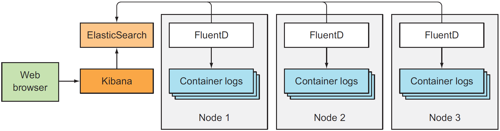

# Handling Application Logs

## Resumen

El documento que se resume a continuación es una sección que forma parte del *capítulo 17* del libro *Kubernetes in Action*, primera edición. Esta sección se titula [Handling Application Logs](./Handling_application_logs.pdf) y en resumen proporciona un mecanismo centralizado de gestión de logs para una infraestructura desplegada en Kubernetes.

La propuesta consiste en agregar en cada uno de los nodos, los cuales podrían contener varios *pods*, agentes *FluentID*. Estos agentes FluentID capturan los logs generados en los nodos, los cuales son enviadosa *Elastisearch* y *Kibana*, ambos únicos y cerntralizados.

Uno de los puntos interesantes es la usabilidad del agente FluentID, en vez del trdicional uso de Logstash, la tercera pata de la conocida infraestructura ELK. Algunos artefactos en internet, citan la diferencia entre *FluentID* y *Logstash* en la descentralización que promueve el primvero con respecto al segundo, utilizable para una arquitectura propiamente centralizada.

## Usabilidad para el proyecto

En este caso la usabilidad estará condicionada a que se utilice una infraestructura basada en *kubernetes*, lo cual aún debe definirse en etapas posteriores. Sin embargo, es importante ir localizando soluciones en materia de monitorización que estén relativamente aceptadas por la comunidad. Debe notarse que la implementación puede ser totalmente personalizable, llevándose a cabo, por ejemplo, usando *Grafana* en vez de *Kibana*.