# OAuth 2

- [OAuth 2](#oauth-2)
  - [Descripción](#descripción)
  - [Introducción](#introducción)
  - [Partes de Oauth](#partes-de-oauth)
  - [Flujo OAuth: Server To Server](#flujo-oauth-server-to-server)
    - [Consideraciones de seguridad](#consideraciones-de-seguridad)

## Descripción

Este documento describe el funcionamiento de OAuth, un estándar diseñado para *delegar autoridad* sobre un recurso y por tanto de mucha utilidad para el desarrollo de este proyecto tanto desde el punto de vista de aplicabilidad como desde el punto de vista conceptual.

## Introducción

El protocolo OAuth no es un protoco diseñado para *autenticación* y en realidad tampoco está diseñado para *autorización*, sino que es un protocolo que proporciona *autoridad delegada* sobre un recurso. Así por ejemplo un usuario de dos aplicaciones, quiere compartir datos entre estas, los cuales están alojados en la *APP 2* (ver figura).

   

Dado que la información/datos están protegidos a través de credenciales de acceso proporcionar dichas credenciales a la *APP 1* traería consigo problemas como:

- La *APP 1* tendrá acceso ahora a todos los datos que viene desde la aplicación 2, por lo que no podrías decidir que datos estarían accesibles y cuales no.
- Actualizar las credenciales de aceeso en la *APP 2* sería complicado porque también habría que actualizarlos en la *APP 1*.
- Proporcionar el nombre de usuario/contraseña a una aplicación de terceros no es una buena idea.

Para este caso de uso es exactamente para lo que OAuth está diseñado. Se usa OAuth para decirle a la *APP 1* de la necesidad de integración con la *APP 2*, por lo que se inicia el flujo de OAuth2.0. De manera que el usuario iniciará sesión en la *APP 2*, la cual aprobará la integración con la *APP 1*, de ahí que *APP 1* nunca podrá ver las credenciales de acceso. De igual forma el usario podrá revisar los niveles de acceso que *APP 1* está solicitando antes de aprobar la integración. Una vez aprobado un token de acceso que se asocia al nivel de acceso, es usado por la *APP 1* para recuperar datos específicos de la *APP 2*

   

OAuth ofrece muchas ventajas sobre la compartición directa de credenciales de acceso con una aplicación de terceros incluyendo:

- El nivel de acceso puede ser verificado y cambiado por otro cuantas veces como se necesite.
- Las credenciales de acceso pueden ser acutalizadas sin destruir las integraciones existentes entre *APP 2* y *APP 1*.
- Se puede revocar el acceso simplemente eliminando el token de aceeso.
- No es necesario compartir las credenciales de acceso con una aplicación de terceros.

## Partes de Oauth

1. El *dueño del recurs*o, es decir, el propietario de los datos.
2. El *cliente* (por ejemplo, la aplicación navegador) a quien se delega la autoridad.
3. El *servidor de autorización*, el cual genera los tokens de acceso.
4. El *servidor de recursos* donde se encuentran alojados los datos del usuario.

   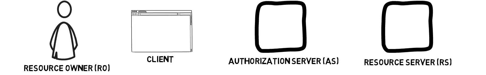

Existen escenarios donde los servidores de recurso y autorización se encuentras hosteados en el mismo servidor o casos donde se encuentren como entidades independientes, es decir. completamente separadas. Las compañias que presentan un servidor central de autorización proporcionan tokens de acceso para todas sus propias aplicaciones.

## Flujo OAuth: Server To Server

Existen muchos flujos de Oauth, sin embargo, *server to server* presenta uno de los escenarios más comunes es uno de los más usados. En este ejemplo tenemos la aplicación uno y dos la *APP 1* es el cliente en el flujo OAuth y la *APP 2* es tanto el servidor de autorización como de recursos.

   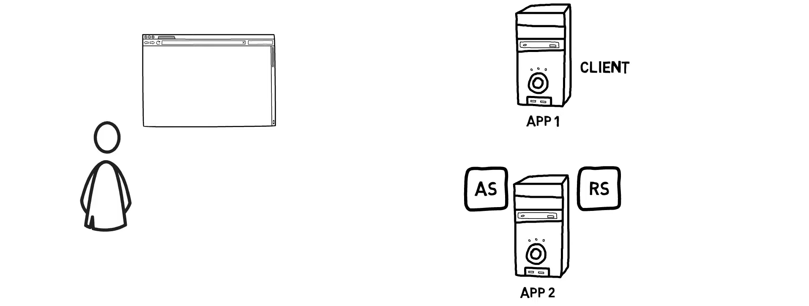

1. Antes de que los usuarios de la *aplicación 1* puedan integrarla con los datos de la *APP 2*, los administradores de cada una de las aplicaciones deben comunicarse entre sí. El administrador de la *APP 1* registra su aplicación en la *APP 2*, proporcionando un nombre o identificador de la aplicación y la url de respuesta o la uri de redirección a la que debe enviar los tokens. 

   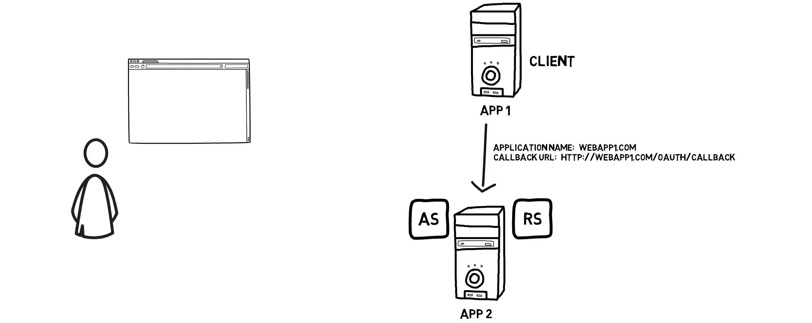

2. El administrador de la *APP 2* genera un identificador de cliente y un secreto que la *aplicación 1* debe utilizar en su comunicación con la *APP 2* de forma muy similar a un nombre de usuario y una contraseña. La identificación del cliente y el secreto pueden, por supuesto, generarse automáticamente a través de la página web de configuración de *APP 2* 

   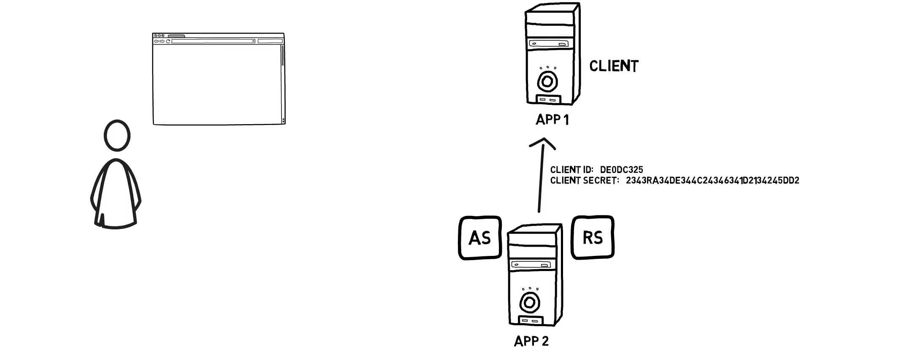

3. Una vez realizada esta configuración inicial, el propietario de los recursos o el usuario puede iniciar el flujo de integración entre las dos aplicaciones.

   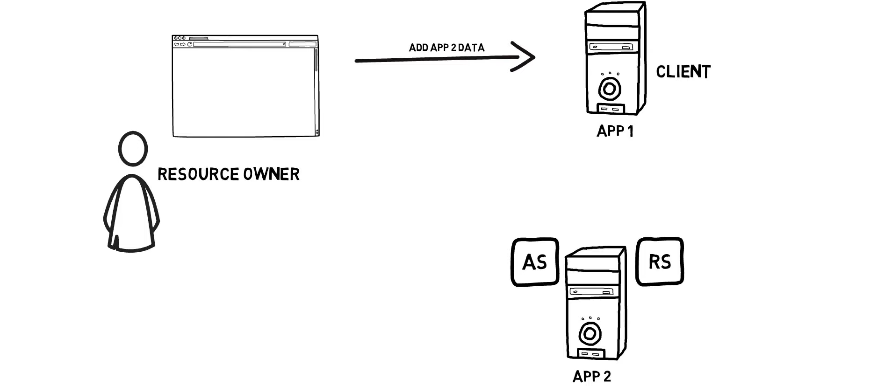

4. El flujo comienza con el navegador web del usuario siendo redirigido con el mensaje que contiene el id del cliente de la *APP 1*,  su uri de redirección y el tipo de respuesta. En otras palabras, qué es lo que quiere la *APP 1*.

   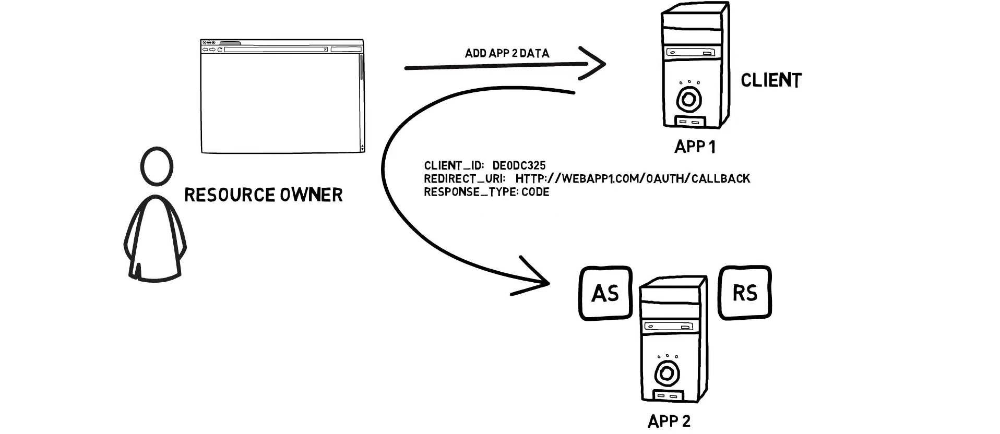

5. En este caso, se trata de un código de autorización para que *APP 1* pueda obtener un token de acceso, pero *APP 1* también debe especificar el alcance (*scope*) del código de autorización. El alcance es el nivel de acceso a los datos del propietario del recurso que se solicita. En este ejemplo, *APP 1* quiere acceder al perfil del usuario y a sus contactos.

   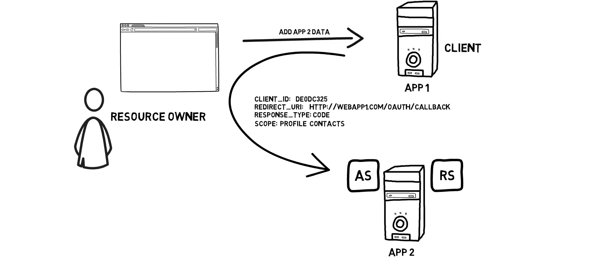

6. El navegador del usuario está ahora conectado a la *APP 2* y, si aún no se ha autenticado, el usuario debe iniciar la sesión.

   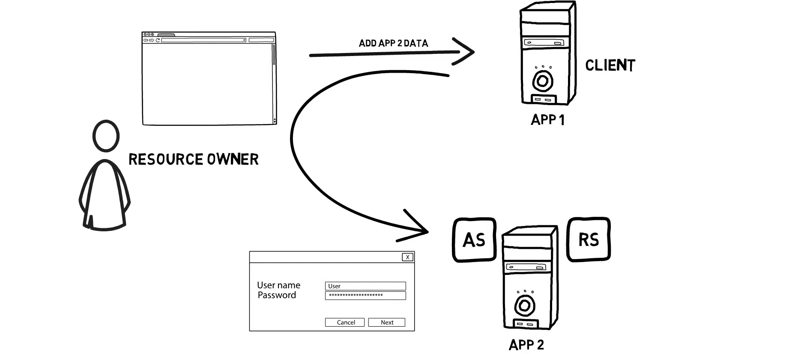

7. El usuario se presenta ahora con el alcance y muchas veces el usuario puede realmente cambiar el nivel de acceso concedido. Por ejemplo, permitir sólo el acceso de lectura al contexto y no el acceso de lectura y escritura.

   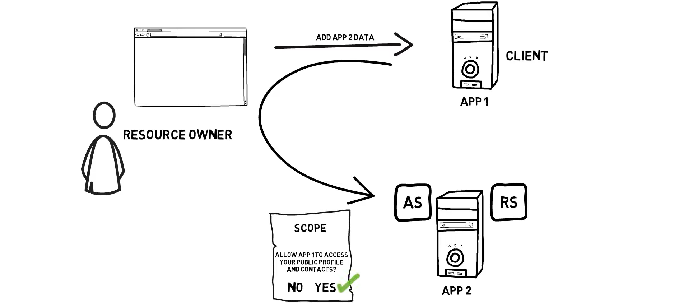

8. Si el usuario aprueba o da su consentimiento a la negociación del alcance (*scope*), se genera un código de autorización que se envía a la *APP 1* a través del navegador del usuario.

   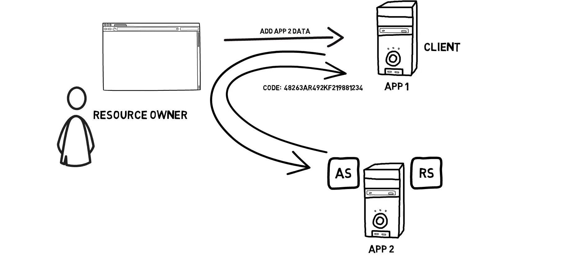

9. La *APP 1* toma este código de autorización y lo envía directamente a *APP 2* junto con su id de cliente y su secreto especificando que quiere intercambiar el código de autorización con un token de acceso.

   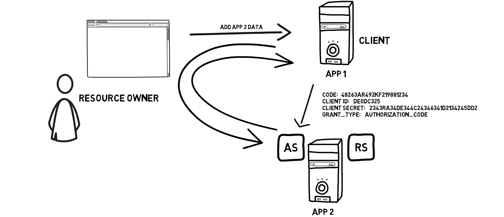

10. El servidor de autorización de *APP 2* genera y envía el token de acceso a la *APP 1*. El token de acceso suele tener un tiempo de vida limitado y es de tipo portador (*bearer*), lo que significa que cualquier persona que disponga de un token puede utilizarlo.

   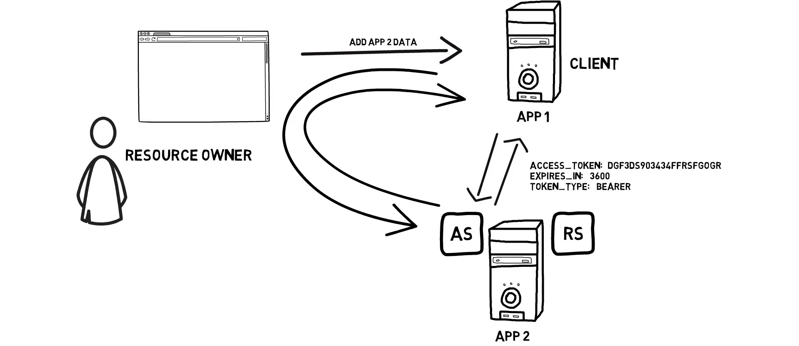

11. Ahora la *APP 1* tiene un token de acceso que le permite acceder a los datos del propietario del recurso y el token de acceso está sellado con los privilegios o el alcance del acceso a los datos.

   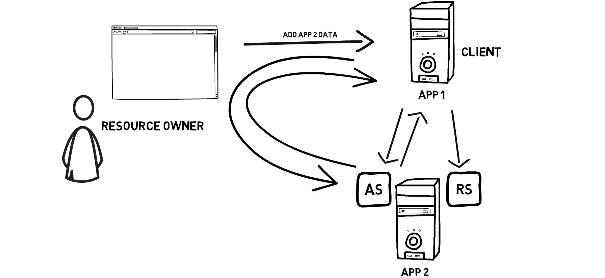

12. El token de acceso se utiliza para autorizar cada una de las llamadas api de la *APP 1* desde la *APP 2*.

   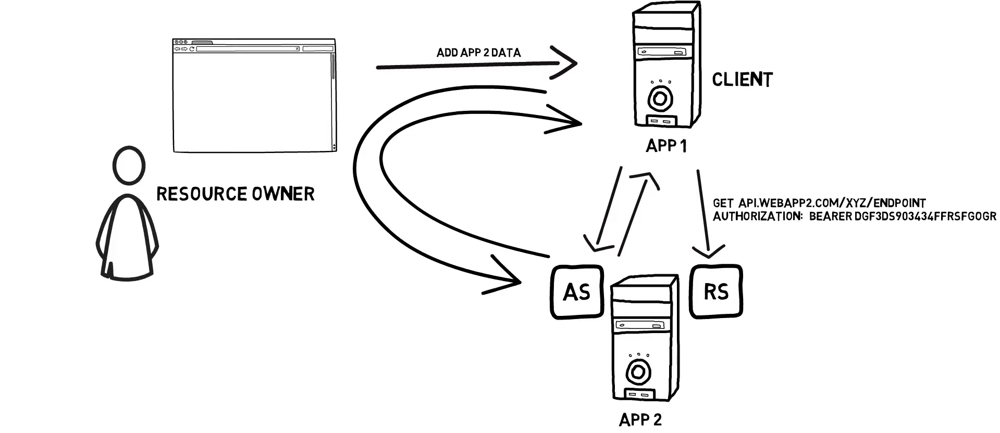

### Consideraciones de seguridad

Los pasos iniciales del flujo se hicieron con la ayuda del navegador del usuario esto se conoce como *comunicación de canal frontal* lo que significa que la información podría ser potencialmente recogida por digamos un actor malicioso que se pueda ejecutar por ejemplo, dentro del propio navegador. Si enviáramos el token de acceso a través del *canal frontal* y dado que es de tipo *bearer* alguien podría robar el token de acceso y acceder a sus datos sin nuestro consentimiento.

   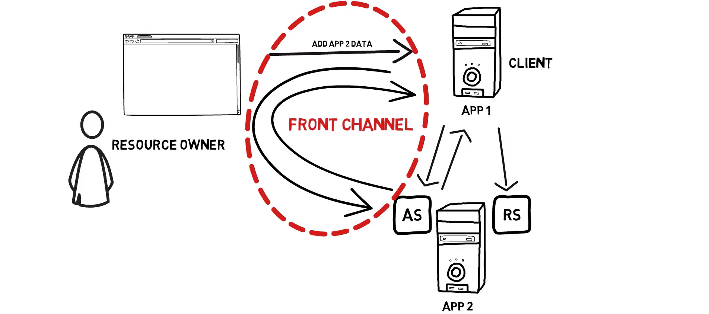

Por lo tanto, el intercambio de un token de acceso se realiza de servidor a servidor utilizando lo que se conoce como un *canal de retorno*. Si alguien consiguiera el código de autorización e intentara cambiarlo por un token de acceso válido, la solicitud fallaría, ya que el secreto del cliente no es conocido por nadie más que por las aplicaciones 1 y 2 en este ejemplo, o mejor dicho, el secreto del cliente no debe ser conocido por nadie más que por las aplicaciones 1 y 2. Así que utilizando el *canal de retorno* y el secreto del cliente deberíamos tener una buena confianza en que el token de acceso sólo se entrega al cliente correcto.

   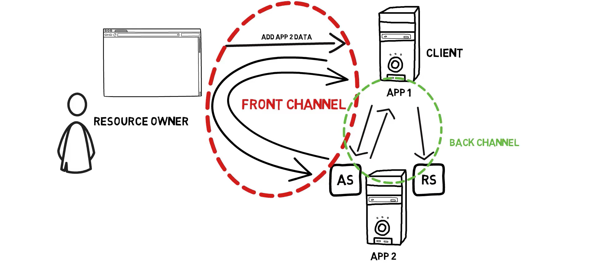