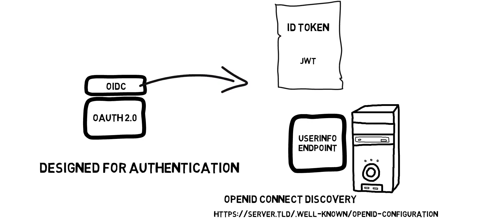
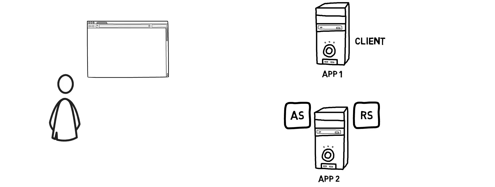
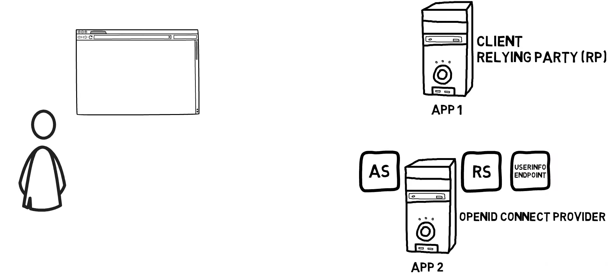
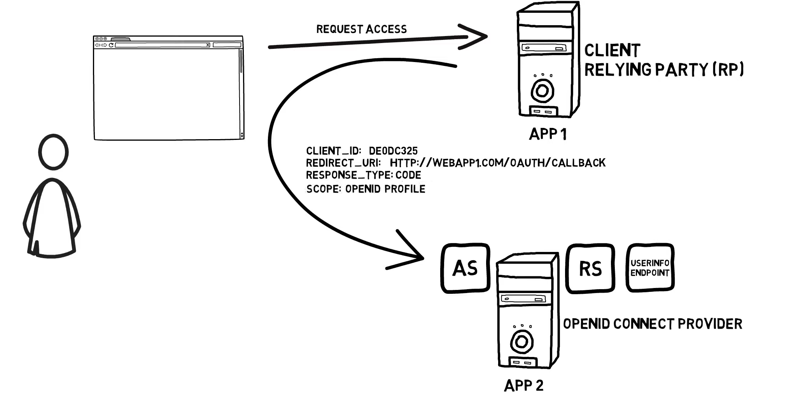
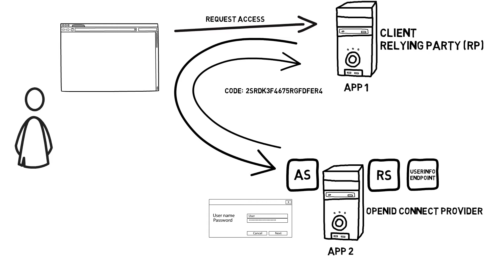
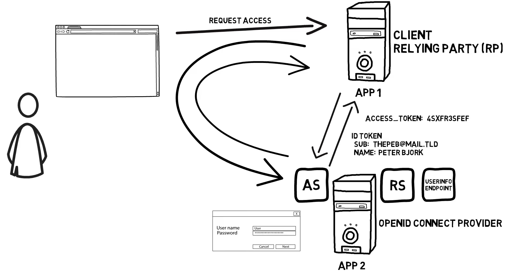
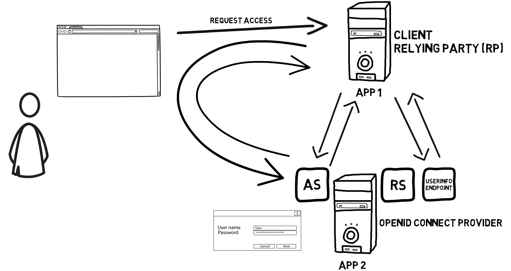

# OPENID CONNECT (OIDC)

- [OPENID CONNECT (OIDC)](#openid-connect-oidc)
  - [Descripción](#descripción)
  - [Introducción](#introducción)
  - [Flujo OpenID Connect en OAuth Server To Server](#flujo-openid-connect-en-oauth-server-to-server)

## Descripción

Este documento describe el funcionamiento de OpenID Connect, un estándar diseñado como capa de *autenticación* al estándar OAuth y por tanto de mucha utilidad para el desarrollo de este proyecto tanto desde el punto de vista de aplicabilidad como desde el punto de vista conceptual.

## Introducción

Open id connect, a menudo llamado oidc, es un estándar añadido sobre OAuth 2.0. Openid connect requiere OAuth 2.0, y añade la estandarización de proporcionar autenticación de usuarios.

   

Openid connect integra los siguientes aspectos:

1. Añade un token de identificación que debe ser un jwt y el estándar especifica qué claims pueden y deben estar dentro del token de identificación.
2. Añade algo llamado un endpoint de información de usuario y muy parecido a los metadatos en SAML haciendo más fácil establecer la integración y la confianza.
3. Hay un descubrimiento de open id connect que ayuda a la configuración de la integración.

   

## Flujo OpenID Connect en OAuth Server To Server

A continuación estudiaremos el flujo de OpenID Connect considerando las mismas entidades participantes del flujo *server to server* de OAuth.

   

Como se muestra en la siguiente figura, se tienen dos aplicaciones donde una es el cliente pero como ahora también depende de un *claim* para la autenticación del usuario también es una parte confidente (*relying part*). Luego tenemos a *APP 2* que es el proveedor de openid connect en este ejemplo. También tiene el nuevo servicio de información del usuario que se ejecuta en él.

   

1. Cuando el usuario intenta acceder a la APP 1, la APP 1 redirige al usuario al proveedor configurado de open id connect para la autenticación. Esto se hace con un mensaje de redirección muy parecido a nuestro flujo original de OAuth 2.0 pero con un ámbito (scope) adicional el Open Id1.

   

2. El usuario inicia sesión en el proveedor y se envía un código de autorización a la *APP 1*.

   

3. La *APP 1* envía el código de autorización a través del canal de retorno al proveedor y recibe no sólo un token de acceso sino también un token de identificación. El token de identificación contiene algunas claims sobre el usuario, como el asunto que lo identifica de forma exclusiva, pero no se envía toda la información sobre el usuario en el token de identificación, los tokens de identificación deben ser pequeños.

   

4. Si la *relying party* requiere más información sobre el usuario, hace uso de su token de acceso y se conecta al punto final de información del usuario para recuperar más datos y atributos del usuario.

   