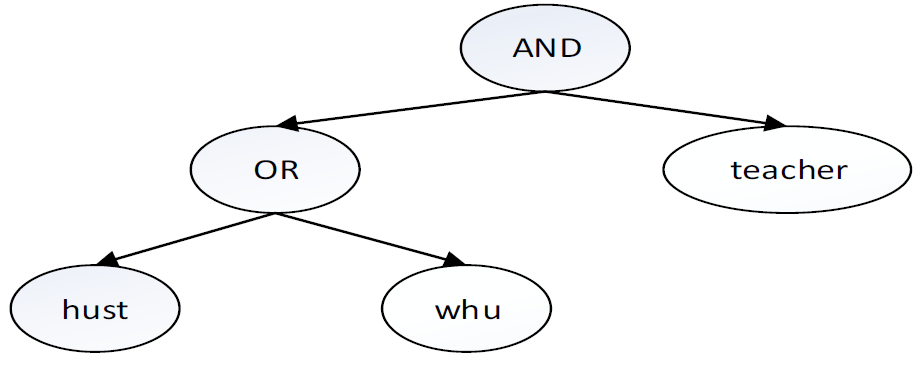

# Ciphertext-Policy Attribute-Based Encryption: (CP-ABE)

El cifrado basado en políticas de atributos (CP-ABE) es una técnica técnica que asocia las claves de cifrado del usuario a los atributos y emplea una política de acceso para cifrar los datos. Esta política es una estructura en forma de árbol compuesta por atributos descriptivos relacionados mediante operadores lógicos (por ejemplo, AND, OR) que que determinan quién puede acceder a los datos en texto plano. Por ejemplo, dejemos que (Director OR (Médico AND Cirujano)) sea una política de acceso. Determina que sólo los usuarios que desempeñan el papel de director o de médico cirujano deben tener acceso a contenido encriptado con dicha política. La primitiva CP-ABE está diseñada de forma nativa para aplicar el control de acceso a los datos mismos, ofreciendo una forma más intuitiva y segura de compartir información.

   

En CP-ABE una Autoridad de Atributos (AA) se encarga de generar a cada usuario una clave secreta compuesta por un conjunto de atributos que describen su perfil en un contexto determinado. Para descifrar un texto cifrado, los atributos de la clave deben satisfacer la política de acceso utilizada para cifrar los datos. En esencia, un sistema CP-ABE consta de cuatro fases:

- *Setup*: Esta fase es llevada a cabo por la AA que recibe como *input* un parámentro de seguridad como lambda y genera tanto la clave pública (PKABE) como la clave maestra (MKABE) del sistema. La clave maestra es conocida solamente por AA.
  
- *Key generation*: Esta fase es llevada a cabo por la AA y toma como *input* la clave pública (PKABE), la la clave maestra (MKABE), el conjunto de atributos A y el identificador único del usuario IDU. El *output* es un secreto el cual se envía al usuario (KuABE). *Nota: En nuestro entorno el usuario es el Editor*
  
- *Encryption*: Esta fase es llevada a cabo por el usuario/editor identificado con IDU que recibe como *input* un Access Control Policy (PABE), la clave pública (PKABE), y el texto claro que será cifrado. El *output* es un criptograma Cum,ABE.

- *Decryption*: Esta fase es llevada a cabo por el editor/usuario identificado IDU que recibe como unput el secreto (Ku1ABE) y el criptograma Cu2m,ABE (donde u1 y u2 podrían ser los mismos pero en nuestro caso no lo son). El *output* es el mensaje original m en texto plano si los atributos de la clave satisfacen la política de acceso empleada en el algoritmo de cifrado.