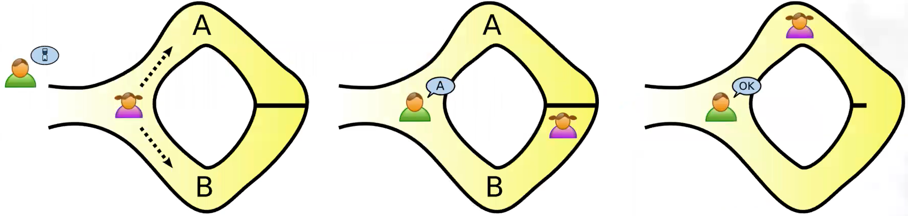

# Credenciales con Zero Knowledge Proof

- [Credenciales con Zero Knowledge Proof](#credenciales-con-zero-knowledge-proof)
  - [Descripción](#descripción)
  - [Sistema básico de Credenciales](#sistema-básico-de-credenciales)
  - [Definición de Credenciales Verificables](#definición-de-credenciales-verificables)
    - [Propiedades de las credencial verificable](#propiedades-de-las-credencial-verificable)
  - [Definición de Credenciales Anónima](#definición-de-credenciales-anónima)
    - [Propiedades adicionales de las credencial anónimas](#propiedades-adicionales-de-las-credencial-anónimas)
      - [Selective Disclosure](#selective-disclosure)
      - [Privada](#privada)
      - [Predicates](#predicates)
      - [Non-correlating](#non-correlating)
  - [Pruebas de Conocimiento Cero o Zero Knowledger Proofs (ZNP)](#pruebas-de-conocimiento-cero-o-zero-knowledger-proofs-znp)
    - [Explicación menos formal de ZKP](#explicación-menos-formal-de-zkp)
    - [Instancias de ZKP](#instancias-de-zkp)
      - [Non-interactive zkp (NIZK)](#non-interactive-zkp-nizk)
      - [¿Qué se puede hacer con ZKP?](#qué-se-puede-hacer-con-zkp)
      - [Zero-Knowledge Protocol](#zero-knowledge-protocol)
  - [¿Qué se puede probar con el ZK en una credencial verificable?](#qué-se-puede-probar-con-el-zk-en-una-credencial-verificable)

## Descripción
Este documento pretende mostrar la integración de las credenciales verificables con la tecnología Zero Knowledge Proof.

## Sistema básico de Credenciales
Se conoce que un sistema de credenciales consta de tres partes: *issuer*, *holder* y *verifier*. El *holder* obtendrá las credenciales de un *issuer* y deberá demostrar la posesión al *verifier* utilizando atributos firmados por el *issuer* la mismo tiempo que el *holder* no podrá cambiar los atributos. Finalmente el *verifier* deberá confiar en el *issuer*.

## Definición de Credenciales Verificables
Una credencial es un conjunto de uno o más reclamos emitidos por un *issuer*. Por tanto, una *credencial verificable* es una credencial a prueba de manipulaciones que tiene autoría que puede ser verificada criptográficamente. Es decir, una *credencial verificable* representa algo que es presentable que es auténtico, que no puede cambiar y de la cual puedes decir quién la ha firmado.

### Propiedades de las credencial verificable
- **Credencial:** Conjunto de reclamos acerca de un sujeto, emitidos por un *issuer*.
- **Prueba de manipulaciones:** El verificador puede detectar si el conjunto de *claims* han sido alterados.
- **Infalsificable:** El *holder* no puede proporcionar un reclamo al *verifier* que no haya sido previamente firmado.
- **Autoría verificable:** El verificador puedevalidar quien es el *issuer*.
- **Intransferible:** No transmite ninguna información excepto a los implicados

## Definición de Credenciales Anónima
Aunque por definición una *credencial anónima* es una *credencial verificable* y por lo tanto mantiene el conjunto de propiedades mencionadas, es decir, es una credencial, es a prueba de manipulaciones, es infalsificable, es auditable e intransferible, las credenciales anónimas presentan propiedades adicionales incluyendo:

### Propiedades adicionales de las credencial anónimas
- **Selective Disclosure:** El *holder* selecciona que *claims* muestra a un *verifier*. Es decir, únicamente mostrará la información mínima necesaria.
- **Privada:** Únicamente se revela la información que el *holder* elige de manera que no podrá revelarse datos adicionales.
- **Predicates:** Declaraciones adicionales sobre los atributos.
- **Non-Correlating:** El *holder* no puede ser correlacionado por valores distintos a los de la credencial. Es decir, que la credencial no podrá ser usada por otro *holder* en otro contexto.

A continuación se analizan estas propiedades más en detalle a partir de ejemplos:

#### Selective Disclosure
*Selective disclosure* significa que de los 10 atributos que tiene el *holder* revelará únicamente, nunguno, uno o todos, pero siempre debe tener la opción de seleccionar. Así por ejemplo, en un escenario donde el Número de la Seguridad Social (NSS) tiene como *claims* el nombre y el NSS, puedo que querer revelar mi nombre, pero no mi Número de la Seguridad Social (NSS), de manera que yo puedo probar que tengo un SSN emitido por un *issuer* sin mostrar este identificador, para lo cual únicamente me valdría con demostrar que el *issuer* lo ha firmado.

#### Privada
La propiedad de *privada* implica que no podrá ser revelada información privada. Considerando el ejemplo anterior, el *verifier* queiere conocer el nombre del *holder* y que posee un NSS válido. Sin embargo, nadie podrá aprender el valor del NSS.

#### Predicates
De la misma manera que el *Selective disclosure* revela el valor de cierto atributo, las pruebas de predicado permiten ocultar su valor. Por ejemplo, si la credencial de una cuenta de banco tiene como *claims* la fecha en que fue creada y el balance de la cuenta, con una *credencial anónima* el *holder* puede reverlar la fecha en que fue creada la cuenta y ocultar el balance de esta, sin dejar de probar que el balance de la cuenta es superior a una cantidad límite.

#### Non-correlating
No habrá una única característica en la credencial que permita relacionar al *holder* en otro contexto. Los posibles valore correlacionables que pueden estar incluidos en una credencial verificable son:
- Un identificador del *holder*, el cual únicamente identifica el *holder* a modo de garantía del mismo.
- Una firma, la cual es única e incluida en cada presentación.
- Valores de los *claims*, los cuales pueden identificar de forma exclusiva al *holder*.

## Pruebas de Conocimiento Cero o Zero Knowledger Proofs (ZNP)
Un *prover* (*holder*) convence a un *verifier* de que una declaración es verdadera sin revelar nada más, de manera que si es verdadera el *verifier* es convencido, si es falsa el *prover* no puede engañar al *verifier* y el *verifier* no puede averiguar nada más acerca del *prover*.

En términos más formales ZNP debe satisfacer 3 propiedades:

- **Completeness:** Si la declaración es verdadera, el *verifier* estará convencido de que es una declaración realizada por un *prover* honesto.
- **Soundness:** Si la declaración es falsa, ningún *prover*, aunque no sea honesto, podrá convencer al *verifier* de que la declaración es verdadera, salvo por una muy pequeña probabilidad, es decir, la probabilidad de que pueda existir un engaño es tan pequeña que el *verifier* puede fiarse de esta.
- **Zero-knowledgeness:** Si la declaración es verdadera el *verifier*, no puede averiguar ninguna otra cosa que la información necesaria para comprobar que la que la declaración es verdadera.

### Explicación menos formal de ZKP
La forma clásica de explicar la ZNP es con el análsis del problema de la cueva de Ali Babá, la cual es una cueva con dos caminos que conectan a a una puerda cerrada. Peggy (*prover*) sabe como abrir la puerta y ella quiere demostrarselo únicamente a Víctor (*verifier*). Para este motivo, Peggy aletoriamente selecciona un camino mientras Víctor espera afuera. Una vez que Peggy a abierto la puerta, Víctor selecciona una salida, es decir, sale por la salida A o B, de manera que Peggy saldrá por la salida seleccionada por Víctor.

Peggy y Víctor repetirán la prueba, como muestra la siguiente figura, hasta que Víctor esté convencido que Peggy sabe como abrir la puerta, de ahí que la clave de la solución del problema esté en la *repeteción*. En cada iteración hay un 50% de posibilidad de que Peggy esté haciendo trampa, sin embargo, despúes de 20 rondas hay más de una posibilidad entre un millón de que ella conozca el secreto, por lo que Víctor puede decidir ques suficiente para él.

   

Ahora, lo importante es que Víctor nunca sabrá como Peggy abre la puerta, pero tiene la capacidad de repetir la prueba tantas veces como quiera hasta considerar que Peggy realmente sabe como abrir la puerta, es decir, conoce/tiene el *secreto*. De esta forma, si mapeamos este ejercicio en función de las tres propiedades anteriores:

- **Completeness:** Víctor, estará convencido.
- **Soundness:** Basado en la repetición, si Peggy miente Víctor podrá detectarlo.
- **Zero-knowledgeness:** Víctor no ha aprendido como Peggy puede abrir la puerta, es decir, no conoce el secreto que Peggy sabe/tiene.

### Instancias de ZKP
- Interactive ZKP (zk-POK)
- Non-interactive zkp (NIZK): Por ejemplo, Sovrin usa este.
- Signature proof ok Knowledge (SPK): Es el usado por las credenciales de Sovrin.
- Succinct non-interactive argument of knowledge (zk-SNARK): Implementado por ZCash.
- Succinct transparent argument of knowledge (zk-STARK): Postcuántico.

#### Non-interactive zkp (NIZK)
NIZK es comunmente usada porque significa que no hay necesidad de ir y venir y por tanto la probabilidad no se calcula a partir de repeticiones, como el caso de cueva de Ali Babá, sino es calculada aletoriamente a través de una *función hash*.

#### ¿Qué se puede hacer con ZKP?
ZNP permitirá detectar si un número es mayor o menor que una cantidad (aplicable a *credenciales verificables* y *selective disclosure*), permitirá detectar si un número está o no dentro de un conjunto (aplicable a *range proofs*), permitirá reconstruir atributos o incluso ocultarlos (aplicable a membership proofs). Además es posible por ejemplo, enviar dinero, sin saber quién lo ha enviado (aplicable a pagos anónimos). Por último, ZNP también podrá usarse como parte de pagos tradicionales.

#### Zero-Knowledge Protocol
El protocolo ZK presenta las siguientes condiciones:

1. El *verifier* necesita saber que el *Holder* no está haciendo trampa.
2. El *holder* necesita saber que el *verifier* no puede descubrir el secreto.
3. Ambas partes contribuyen aleatoriamente.
4. La aleatoriedad es única por interacción
5. El *holder* combina la aleatoriedad de ambos para proteger el secreto.
6. El *verifier* usa su propia aleatoriedad para asegurarse que el *holder* no está mintiendo.

Con base al funcionamiento de Diffie-Hellmann y RSA, un ejemplo del protocolo que NIZK para que el *prover* convenza al *verifier* de que conoce el secreto *x* sería:

- El *verifier* genera un número primo aleatorio *n*.
- El *verifier* genera un número aleatorio *1 < i < n*.
- El *verifier* genera un número aleatorio *1 < g < n*.
- El *verifier* selecciona el algoritmo de hashing *H*.
- El *verifier* envía *n*, *g*, *i*, *H* al *prover*.
- El *prover* recibe *n*, *g*, *i*, *H* del *verifier*.
- El *prover*:
  - genera un número aleratorio *r < n*
  - calcula:
    - a valor de prueba: *tH = gr mod n*
    - un enlace con el secreto:  *y = gx mod n*
    - un challenge hash: *cH = H(tH, i)*
    - un challenge value: *s = r - cHx*
  - envía al *verifier*: *y*, *s*, *cH*.
- El *verifier* recibe: *y*, *s*, *cH* del *prover*.
  - calcula:
    - a valor de prueba: *tV = gsycH mod n*
    - un challenge hash: *cV = H(tV, i)*
  - verifica que: *cV == cH*
- Esto funciona porque *tV == tH* lo cual significa que *H(tV, i) == H(tH, i)*

La demostración de estas igualdades pasa por lo siguiente:
1. Una vez que el *prover* genera:
   1. *tH = gr mod n*
   2. *y = gx mod n*
   3. *s = r - cHx*
2. El verifier calcula: *tV = gsycH mod n*, así:
   1. *tV = gs - cHx(gx)cH mod n*
   2. *tV = gs - cHxgcHx mod n*
   3. *tV = gs - cHx + cHx  mod n*
   4. *tV = gr mod n*

## ¿Qué se puede probar con el ZK en una credencial verificable?
- Que el *holder* tiene una firma de credencial válida emitida por un *issuer*.
- Que el *holder* no revela la firma de la credencial.
- Que el *holder* no ha cambiado ninguno de los valores firmandos.
- Que el *holder* elige los valores a revelar en la prueba, de manera que si la credencial tiene N atributos:
  - Pueden ser revelados 0 de N.
  - Pueden ser revelador de ninguno a todos.
  - Pueden ser revelados los que el *holder* seleccione.