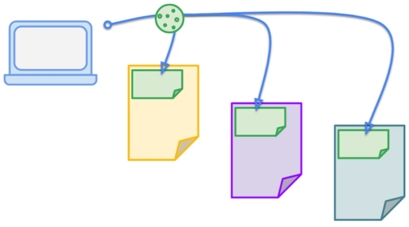
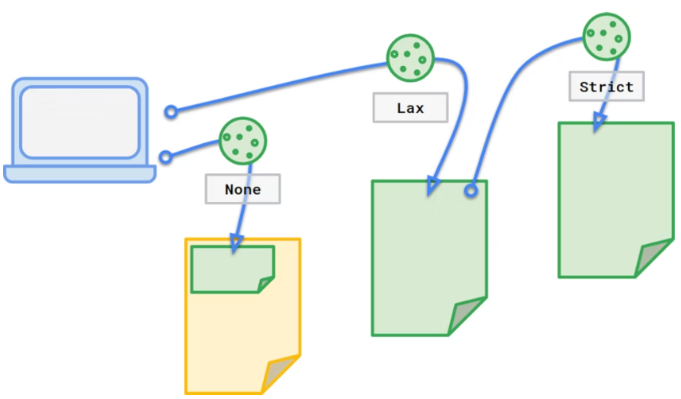

# Third-Party Cookies & Authentication

Este documento asume que el widget LexForMe es tratado como Third-Party Cookie. De forma tal, que teniendo en cuenta las consideraciones que a continuación se exponen, pueda ser tratado como otro mecanismo de autenticación dentro del Flow OAuth propuesto en el documento [Basic flow for Delegation Authority and Authentication](../../../T2/basic_delegated_authority_authN/delegating_authority_authN.md) para de esta forma evitar que dentro del Flujo OAuth/OpenID-Connect Server to Server por un lado el login del usuario y por otro el access token, pasen  a través del *client* (entidad representativa el caso de uso).

   

## Introducción

Las *first-party cookies* son cookies creadas por el dominio visitado. Las *third-party cookies* son cookies creadas por un dominio diferente al visitado. Por ejemplo, si visitamos el sitio *ejemplo.com* el cual utiliza un plugin integrado (el cual está integrado a través de un *iframe*) de *mi.plugin.com*,  *plugin.com* se trata como una *third-party cookie*.

## Autenticación

Si la aplicación es independiente, siempre se utiliza como una *first-party cookie*, pero en nuestro caso, dado que nuestra aplicación puede ser un plugin que forma parte de otra aplicación (ejemplos de plugin: Trello, JIRA, etc), en este caso tu aplicación es tratada por el navegador como una *third-party cookie*. Hay dos enfoques comunes para la autenticación, analizando cómo funcionan con respecto a las *third-party cookie*:

### Stateless Authentication

Normalmente no tiene nada en común con las cookies. El token se añade en cada solicitud por motivos de autenticación. Se puede añadir como un *header* o como un parámetro de consulta. Funciona bien tanto para casos de *first-party* como de *third-party* porque no utiliza cookies en absoluto.

### Stateful Authentication

Se implementa a través de la *sesión*. Es común establecer el *id de sesión* en la cookie para poder enviarlo automáticamente con cada petición. Como opción alternativa, el *id de sesión* se puede pasar como un *parámetro de consulta*.
- Si el *parámetro de consulta* se utiliza para el *identificador de sesión*, entonces no habrá problema dado que no se estará utilizando cookies.
- Si se utilizan *cookies*, entonces podemos tener problemas dado que nuestra aplicación actúa como *third-party* (está integrada en otra aplicación en otro dominio), dado que no es posible establecer las propias cookies de sesión, ya que los nuevos navegadores las bloquean.

#### Cómo resolver este problema

1. Migrando a la autenticación basada en tokens, ofreciendo mecanismos de obtención, almacenamiento y actualización de tokens de corta duración.
2. Arreglar el problema de las cookies:
   1. Dado que en nuestro caso se pretende usar OAuth, se debe abrir las pantallas de autenticación y consentimiento en ventanas separadas (**evitando de esta forma el ataques como el click hijacking o el tracking del usuario**), de esta manera, la cookien de sesión será una *first-party cookie*.
   2. Habilitar por parte del cliente (entidad representativa el caso de uso) que la *first-party cookie* contenga el atributo *SameSite*

