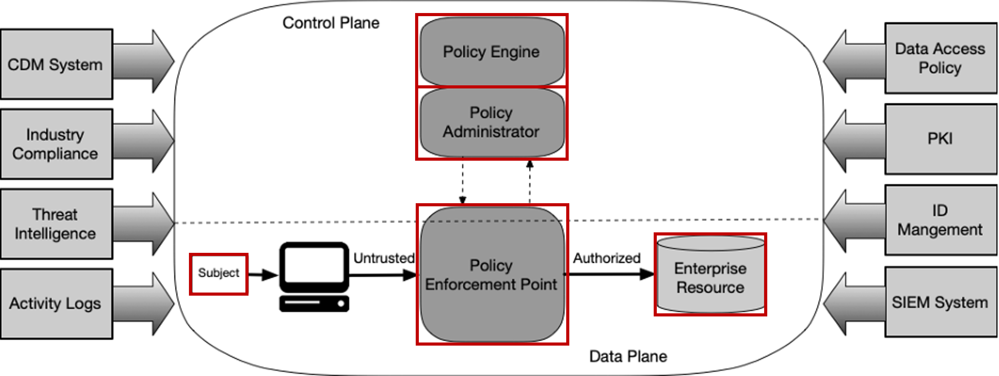

# CAPTURA DE REQUISITOS

## Descripción
- La siguiente tarea (*T1*) constituye el punto de partida del proyecto *MULTIJURISDICTIONAL COMPLIANCE FRAMEWORK USING BLOCKCHAIN TECHNOLOGY*, pretendiendo aglutinar no sólo información relativa al estado del arte de los sistemas Zero Trust Architecture, sino también al conjunto de tecnologías y herramientas de utilidad para etapas de diseño e implementación.

## Estructura organizativa de la Tarea T1
* La *Arquitectura Zero Tust* promovida por NIST constituye la base del proyecto, de ahí que los principales bloques que conforman dicha arquitectura constituyen las carpetas base de la documentación.



### Navegar en la tarea T1
1. [Subject](./Subject/subject.md)
2. [Network](./Network/Network.md)
2. [Policy Engine](./Policy_Engine/Policy_Engine.md)
3. [Enterprise Resource](./Enterprise_Resource/Enterprise_Resource.md)
3. [Policy Administrator](./Policy_Administrator/Policy_Administrator.md)
4. [Policy Enforcement Point](./Policy_Enforcement_Point/Policy_Enforcement_Point.md)
5. [Monitoring Resources](./Monitoring_Resources/monitoring_resources.md)

## ¿Cómo contribuir?
- A continuación se dan las pautas a seguir para contribuir en el repositorio:
1. **Clone el repositorio**:
    ````bash
    git clone https://github.com/LexProgram/BIBLIOTECA.git
    ````

2. **Crear una nueva rama. E.g.**:
    ````bash
    git checkout -b contributor1
    ````

3. **Siga los siguientes pasos si va a contribuir con documentos**:
    *Documento incluye tanto artículos científicos como artefactos de internet (e.g.: artículos de medium) que sean relevantes para el proyecto. Unícamente en caso de ser ún artefacto, este deverá convertirse a pdf para su posterior almacenamiento en esta carpeta*

    1. Vaya dentro de la carpeta base. E.g.:
        ````bash
        cd ./Enterprise_Resource
        ````   
    2. Crear una carpeta dentro de la carpeta base. E.g.:
        ````bash
        mkdir deploy_a_private_IPFS_network
        ````
    3. Vaya dentro de esta carpeta. E.g.:
        ````bash
        cd ./deploy_a_private_IPFS_network
        ````
    4. Copiar el archivo `*.pdf` dentro de la carpeta.

    5. Crear un archivo con extensión `*.md`. E.g.: 
        ````bash
        touch deploy_a_private_IPFS_network.md
        ````
    6. Agregar un resumen del documento *pdf*

    7. Agregar un enlace al documento *touch deploy_a_private_IPFS_network.md* en el archivo *Enterprise_Resource.md* que se encuentra en la carpeta base *Enterprise_Resource*. La forma adecuada para agregar el enlace en el `*.md` sería:
        ````bash
        [Nombre Documento](./deploy_a_private_IPFS_network/nombre_documento.pdf)
        ````

    8. Traslada la información a la rama remota:
        ````bash
        git add .
        git commit -m "new document added"
        git push --set-upstream origin contributor1
        ````
    9. Hacer merge sobre la rama principal:
        ````bash
        git checkout main
        git merge contributor1
        git push
        ````
    10. Borrar la rama creada en el *repositorio remoto*:
        ````bash
        git push origin --delete contributor1
        ````
    11. Borrar la rama en el *repositorio local*:
        ````bash
        git branch -d contributor1
        ````

4. **Siga los siguientes pasos si va a contribuir con herramientas**
    1. Vaya dentro de la carpeta base. E.g.:
        ````bash
        cd ./Enterprise_Resource
        ````
    2. En el documento de ejemplo *Enterprise_Resource.md* agregue una nueva fila en la tabla completando los siguientes campos:
        1. Nombre de la herramienta
        2. URL de la herramienta
        3. Descripción de la herramienta
    3. Traslada la información a la rama remota:
        ````bash
        git add .
        git commit -m "new document added"
        git push --set-upstream origin contributor1
        ````
    4. Hacer merge sobre la rama principal:
        ````bash
        git checkout main
        git merge contributor1
        git push
        ````
    5. Borrar la rama creada en el *repositorio remoto*:
        ````bash
        git push origin --delete contributor1
        ````
    6. Borrar la rama en el *repositorio local*:
        ````bash
        git branch -d contributor1
        ````