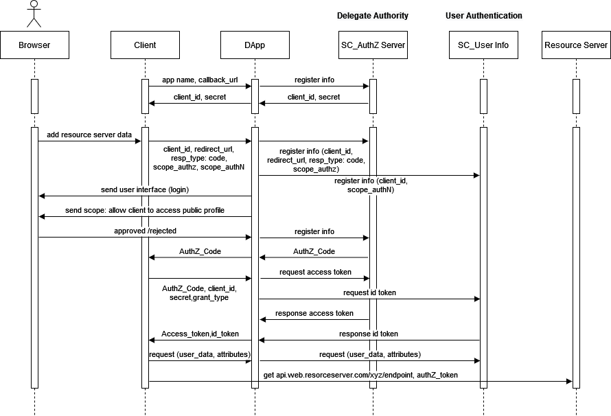
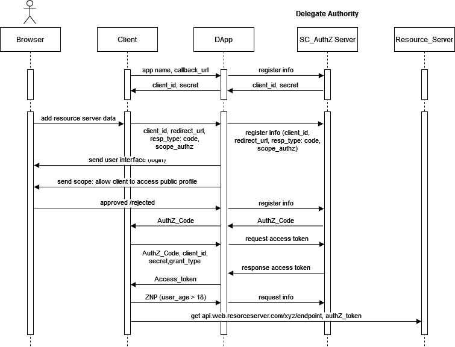
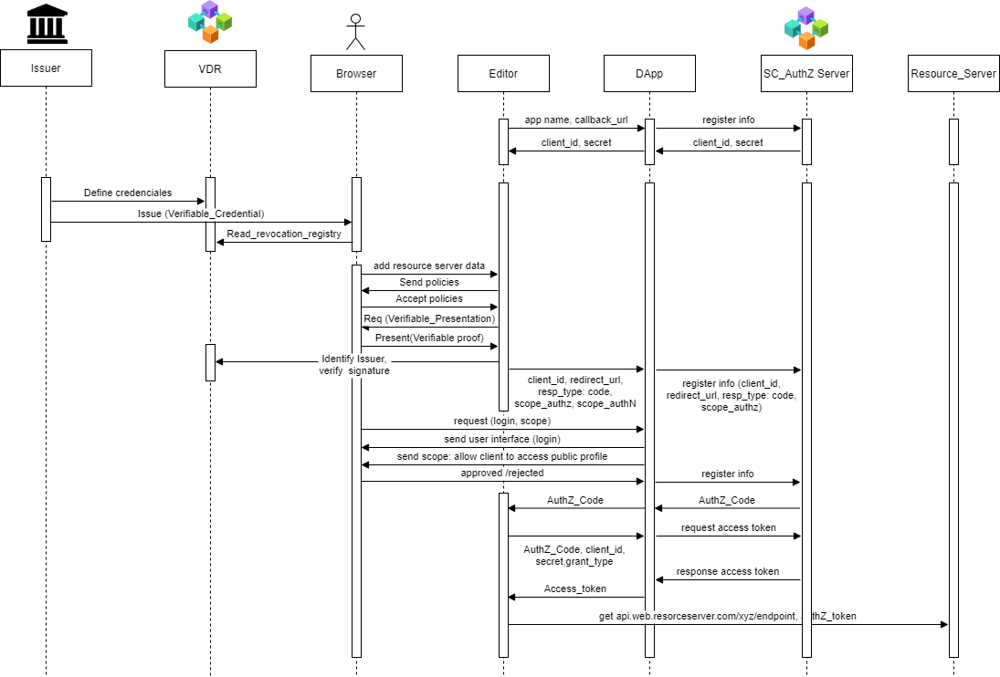
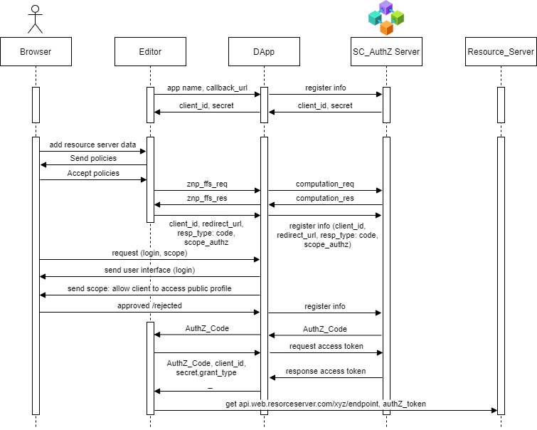

# Basic flow for Delegation Authority and Authentication

## Descripción

El siguiente documento pretente presentar una primera aproximación del diseño de un flujo para la delegación de autoridad sobre un recurso, así como la autenticación del *usuario*. Se asume por un lado, que en una etapa previa se ha diseñado el flujo para que el *usuario* registre sus datos en el sistema diseñado por Lex, que actuará como custodio de estos y por otro lado, que Lex se ha puesto de acuerdo con diferentes servicios como por ejemplo *servicios médicos* para que agreguen el *botón de autenticación* a través de Lex. Se puede crear un sistema para que Lex no tenga que negociar con los diferentes servicios, basado en que el *usuario* solicite la necesidad de usar la plataforma de Lex.

## Entidades participantes

El flujo contiene 7 entidades participantes para garantizar por un lado que el acceso al recurso del usuario, sea delegado al cliente y por otro, que el usuario sea autenticado antes que el recurso sea accedido. A continuación una breve descripción de las entidades participantes:

- El *usuario* es la persona que usará cierto servicio, para por ejemplo, monetizar sus datos.
- El *cliente* es la entidad sobre la que se delegará la autoridad para acceder a los recursos pertenecientes al usuario 1. Representa básicamente un *servicio* como puede ser un *servicio médico*.
- La App Lex1 constituye una aplicación *propietaria* de Lex, encargada de interactura con el Smart Contract1 para delegar la autoridad.
- El Smart Contract1 hace la función del *Authorization Server* del estandar OAuth2.0.
- La App Lex2 constituye una aplicación *propietaria* de Lex, encargada de interactura con el Smart Contract2 para autenticar al *usuario*.
- El Smart Contract2 hace la función del *OpenID Connect Provider* del estandar OpenID Connect.
- El Servidor de *Recursos* es un sistema de almacenamiento persistente de datos *propiedad* de Lex, el cual es utilizado para custodiar la información del *usuario*. Los modelos de datos se están definiendo en la sección [Data Modeling](../data_modeling/data_modeling.md)

## Delegation Authority and Authentication Flow

### Fase de registro de la aplicación cliente

1. Producto de la negociación previa entre Lex y el cliente, por ejemplo el *servicio médico*,  los administradores de cada una de las aplicaciones deben comunicarse entre sí. El administrador del *cliente* registra su aplicación en la App Lex1, proporcionando un nombre o identificador de la aplicación y la url de respuesta o la uri de redirección a la que debe enviar los tokens.
2. La App Lex1 genera un identificador de cliente y un secreto que el *cliente* debe utilizar en su comunicación con la App Lex1 de forma muy similar a un nombre de usuario y una contraseña. La identificación del cliente y el secreto pueden, por supuesto, generarse automáticamente a través de la página web de configuración de APP Lex1.

### Flujo para la delegación de autoridad sobre un recurso itengración OAuth/OpenID Connect sobre blockchain

**Nota:** Este flow tiene en cuenta la fase de registro entre el cliente y la infraestructura de Lex.

En este primer caso se prevee no sólo el uso de OAuth, sin también el uso de OpenID Connect para la autenticación del usuario en el cliente.

   

### Flujo para la delegación de autoridad sobre un recurso itengración OAuth/ZNP sobre blockchain

**Nota:** Este flow tiene en cuenta la fase de registro entre el cliente y la infraestructura de Lex.

Para el desarrollo de esta variante se parte de un consentimiento por parte del usuario para que Lex como fiduciario de los datos del usuario pueda responder ante el cliente en dado caso que este requiera cierta información. Para evitar acceso a información sensible del usuario, así como evitar la presencia del *id_token* generado en el flujo de *OpenID Connect*, la información será solicitada usando las pruebas de conocimiento cero (ZNP).

   

### Flujo para la delegación de autoridad sobre un recurso itengración OAuth/Verfiable Credentials sobre blockchain

**Nota:** Este flow tiene en cuenta la fase de registro entre el cliente y la infraestructura de Lex.
**Nota:** Este flow también tiene en cuenta la fase de emisión de la credencial verificable.

Para el desarrollo de esta variante se parte de que existe una infraestrucutra de identidad autosoberana por detrás por ejemplo, usando Hyperledger Indy, de forma que son emitidas credenciales verificables, las cuales serán usadas como repsentaciones verificables para probar cierta información básica, por ejemplo, ser mayor de edad. Esta interacción se lleva a cabo entre el cliente y el usuario directamente. A continuación, se usa el flow OAuth de Lex para acceder al grueso de los datos del usuario.

1. El *editor* actuando como *verifier* solicita la presentación de la *prueba verificable*.
2. El *usuario* presenta la *prueba verificable*.
3. El  *editor* actuando como *verifier* identifica al *issuer*, verifica la *firma de credencial*.
4. El *editor* se autentica en *Authorization Server* a través de la DApp.
5. El *usuario* se autentica en *Authorization Server* a través de la DApp al mismo tiempo que bypasea al *editor*.
6. Se inicia el flujo OAuth entre el *Authorization Server* y el *Editor*.
7. El editor accede al *Resource Server*.

   

### Flujo para la delegación de autoridad sobre un recurso y la delegración de autenticación usando HFB blockchain

Para el desarrollo de esta variante se presupone la integración del flujo OAuth con el producto LexForWeb. De esta forma una vez que el usuario ha aceptado las políticas contenidas en el Widget de LexforWeb se procede:

1. El *editor* debe autenticar al usuario a través de una autenticación delegada, para la cual se usa el esquema de identificación Feige–Fiat–Shamir.
2. El *editor* se autentica en *Authorization Server* a través de la DApp.
3. El *usuario* se autentica en *Authorization Server* a través de la DApp al mismo tiempo que bypasea al *editor*.
4. Se inicia el flujo OAuth entre el *Authorization Server* y el *Editor*.
5. El editor accede al *Resource Server*.

   