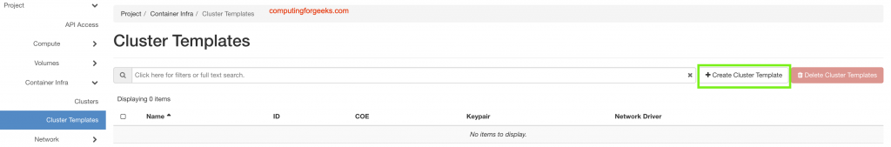
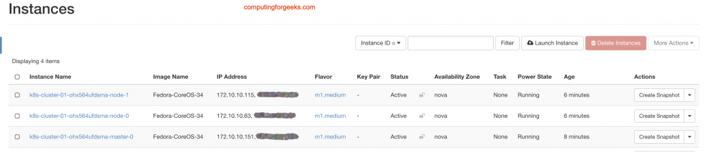
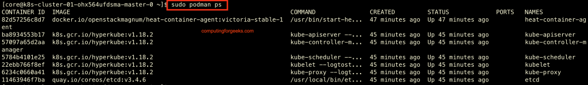
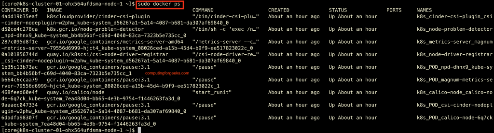

# Create Kubernetes Cluster on OpenStack Magnum with Fedora CoreOS
- [Create Kubernetes Cluster on OpenStack Magnum with Fedora CoreOS](#create-kubernetes-cluster-on-openstack-magnum-with-fedora-coreos)
  - [Step 1: Install and Container Magnum Container Service](#step-1-install-and-container-magnum-container-service)
  - [Step 2: Upload Fedora CoreOS image to Glance](#step-2-upload-fedora-coreos-image-to-glance)
  - [Step 3: Create Kubernetes Cluster Template](#step-3-create-kubernetes-cluster-template)
  - [Step 4: Create a Kubernetes Cluster on OpenStack Magnum](#step-4-create-a-kubernetes-cluster-on-openstack-magnum)
    - [Accessing Kubernetes Cluster nodes](#accessing-kubernetes-cluster-nodes)
  - [Step 5: Retrieve the config of a cluster using CLI](#step-5-retrieve-the-config-of-a-cluster-using-cli)
    - [Install kubectl tool](#install-kubectl-tool)
    - [Installation on Linux:](#installation-on-linux)
    - [Installation on macOS:](#installation-on-macos)
  - [Reference:](#reference)

[OpenStack Magnum](https://wiki.openstack.org/wiki/Magnum) is an OpenStack API service being developed by the OpenStack Containers Team to ease the deployment of container orchestration engines (COE) such as Kubernetes, Docker Swarm, and Apache Mesos in OpenStack Cloud platform. Among the three supported engines, Kubernetes is the most popular one, so this article focuses entirely on Kubernetes. The OpenStack Heat service is used as an orchestration for the cluster creation and management operations.

Magnum has good integration with other OpenStack services, such as Cinder for volumes management, Octavia for Load balancing among other services. This ensures a seamless integration with core Kubernetes. The primary image that will be used to build Kubernetes instances in this guide is [Fedora CoreOS](https://getfedora.org/en/coreos?stream=stable).

This guide assumes you already have a running OpenStack cloud platform with Cinder configured. Our Lab environment is based on OpenStack Victoria running on CentOS 8. The installation was done using the guide in the link below:

- [Install OpenStack Victoria on CentOS 8 With Packstack](https://computingforgeeks.com/install-openstack-victoria-on-centos/)

You should also have OpenStack client configured in your Workstation and able to access with OpenStack API endpoints:

- [OpenStack client installation and configuration](https://computingforgeeks.com/install-and-configure-openstack-client-on-linux/)

The [Cinder Block Storage](https://docs.openstack.org/cinder/victoria/admin/) service must have configured backend to be used for Docker volumes and instance data storage. If using LVM on Cinder it should have free space used by Docker volumes:

```console
$ sudo vgs
  VG             #PV #LV #SN Attr   VSize    VFree
  cinder-volumes   1   8   0 wz--n-  986.68g <286.54g
```

## Step 1: Install and Container Magnum Container Service

Install OpenStack Magnum packages and configure it using the guide below:

- [nstall OpenStack Magnum Container Service on CentOS / Ubuntu](https://computingforgeeks.com/how-to-install-openstack-magnum-container-service/)

Confirm the following key settings thereafter:

```console
$ sudo vim /etc/magnum/magnum.conf
[DEFAULT]
state_path = /var/lib/magnum
log_dir = /var/log/magnum

[certificates]
cert_manager_type = barbican

[trust]
cluster_user_trust = true
```

If you don’t have Barbican service setup refer to the guide: [Install and Configure OpenStack Barbican Key Manager Service](https://computingforgeeks.com/install-and-configure-openstack-barbican-key-manager-service/)

Restart Magnum services:

```console
sudo systemctl restart openstack-magnum-api openstack-magnum-conductor
```

Confirm Magnum service status on the Controller node:

```console
$ openstack coe service list
```

## Step 2: Upload Fedora CoreOS image to Glance

Fedora CoreOS will be used as the underlying OS for nodes that are provisioned via Magnum.

Visit [Fedora CoreOS Downloads](https://computingforgeeks.com/create-kubernetes-cluster-on-openstack-magnum-with-fedora-coreos/#:~:text=Fedora%20CoreOS%20Downloads) page and choose a release stream and matching OpenStack .xz image then download from the given URL using the wget:

```console
wget https://builds.coreos.fedoraproject.org/prod/streams/stable/builds/34.20211004.3.1/x86_64/fedora-coreos-34.20211004.3.1-openstack.x86_64.qcow2.xz
```

Extract downloaded image archive:

```console
unxz fedora-coreos-34.20211004.3.1-openstack.x86_64.qcow2.xz
```

Upload image to glance:

```console
openstack image create Fedora-CoreOS-34 \
  --public \
  --disk-format=qcow2 \
  --container-format=bare \
  --property os_distro='fedora-coreos' \
  --file=fedora-coreos-34.20211004.3.1-openstack.x86_64.qcow2
```

The image uploaded must have the attribute ‘os_distro‘ defined as appropriate for the cluster driver. For Fedora CoreOS the value should be fedora-coreos.

Confirm image availability after the upload:

```console
$ openstack image list --column Name --column Status
+----------------------+--------+
| Name                 | Status |
+----------------------+--------+
| CentOS-8             | active |
| Fedora-CoreOS-34     | active |
| Ubuntu-20.04         | active |
| manila-service-image | active |
+----------------------+--------+
```

## Step 3: Create Kubernetes Cluster Template

The Cluster Template describes to magnum how to construct the cluster. Our ClusterTemplate has specification of Fedora CoreOS image so the clusters which use this ClusterTemplate will be based on Fedora CoreOS. But before defining the template pull all required variables/values from OpenStack cloud.

List SSH keypairs and note the one that will be used.

```console
$ openstack keypair list
+---------+-------------------------------------------------+
| Name    | Fingerprint                                     |
+---------+-------------------------------------------------+
| admin   | 19:7b:5c:14:a2:21:7a:a3:dd:56:c6:e4:3a:22:e8:3f |
+---------+-------------------------------------------------+
```

List created Neutron networks to identify private and public network names:

```console
$ openstack network list --column Name --column Subnets
+------------------------+--------------------------------------+
| Name                   | Subnets                              |
+------------------------+--------------------------------------+
| private                | f9ad4192-ad3b-486e-b08f-c907e5d418b8 |
| manila_service_network |                                      |
| public                 | f6f8e542-8aa3-46ec-b13c-d5dff2c80e9f |
+------------------------+--------------------------------------+
```

List available compute flavors. If none you may need to create for Master and worker nodes.

```console
$ openstack flavor list --column Name --column RAM --column Disk --column VPCUs
+------------+-------+------+
| Name       |   RAM | Disk |
+------------+-------+------+
| m1.tiny    |  1024 |   10 |
| m1.small   |  2048 |   20 |
| m1.medium  |  4096 |   30 |
| m1.large   |  8192 |   40 |
| m1.xlarge  | 16384 |   50 |
| m1.xxlarge | 32768 |   60 |
| m1.manila  |   512 |    1 |
+------------+-------+------+
```

I’ll run the command below to create Kubernetes cluster template:

```console
openstack coe cluster template create k8s-cluster-template \
   --image Fedora-CoreOS-34 \
   --keypair admin \
   --external-network public \
   --fixed-network private \
   --fixed-subnet private_subnet \
   --dns-nameserver 8.8.8.8 \
   --flavor m1.medium \
   --master-flavor m1.large \
   --volume-driver cinder \
   --docker-volume-size 10 \
   --network-driver calico \
   --docker-storage-driver overlay2 \
   --coe kubernetes
```

Explanations for each option is available on:

- [OpenStack Magnum user Documentation page](https://docs.openstack.org/magnum/latest/user/)

List templates to confirm it was indeed created:

```console
$ openstack coe cluster template list
+--------------------------------------+----------------------+
| uuid                                 | name                 |
+--------------------------------------+----------------------+
| 5a7378c2-b88e-410a-bbe9-0ef9a239c776 | k8s-cluster-template |
+--------------------------------------+----------------------+
```

The same ClusterTemplate creation process can be performed from Horizon Dashboard; under *Project > Container Infra > Cluster Templates > Create Cluster Template*



If you get an error “forbidden: PodSecurityPolicy: unable to admit pod: []” with some pods starting after cluster creation consider adding below labels:

```console
--labels admission_control_list="NodeRestriction,NamespaceLifecycle,LimitRanger,ServiceAccount,ResourceQuota,TaintNodesByCondition,Priority,DefaultTolerationSeconds,DefaultStorageClass,StorageObjectInUseProtection,PersistentVolumeClaimResize,MutatingAdmissionWebhook,ValidatingAdmissionWebhook,RuntimeClass"
```

## Step 4: Create a Kubernetes Cluster on OpenStack Magnum

If you have “cloud_provider_enabled” label is set to true you must set cluster_user_trust to True in magnum.conf.

```console
$ sudo vim /etc/magnum/magnum.conf
cluster_user_trust = true
```

If you made the change restart magnum Api and Conductor services:

```console
 for i in api conductor; do sudo systemctl restart openstack-magnum-$i; done
```

Use the ClusterTemplate name as a template for cluster creation. This cluster will result in one master kubernetes node and two minion nodes:

```console
openstack coe cluster create k8s-cluster-01 \
    --cluster-template k8s-cluster-template \
    --master-count 1 \
    --node-count 2
```

List kubernetes clusters to check creation status.

```console
$ openstack coe cluster list --column name --column status --column health_status
+----------------+--------------------+---------------+
| name           | status             | health_status |
+----------------+--------------------+---------------+
| k8s-cluster-01 | CREATE_IN_PROGRESS | None          |
+----------------+--------------------+---------------+
```

Once the cluster setup is complete status and health_status will change.

```console
$ openstack coe cluster list --column name --column status --column health_status
+----------------+-----------------+---------------+
| name           | status          | health_status |
+----------------+-----------------+---------------+
| k8s-cluster-01 | CREATE_COMPLETE | HEALTHY       |
+----------------+-----------------+---------------+
```

You should see Cinder volumes created and attached to the instances

```console
$ openstack volume list  --column Name --column Status --column Size
+------------------------------------------+--------+------+
| Name                                     | Status | Size |
+------------------------------------------+--------+------+
| k8s-cluster-01-ohx564ufdsma-kube_minions | in-use |   10 |
| k8s-cluster-01-ohx564ufdsma-kube_minions | in-use |   10 |
| k8s-cluster-01-ohx564ufdsma-kube_masters | in-use |   10 |
+------------------------------------------+--------+------+
```

To list created Virtual machines use the commands below which have a filter to limit number of columns displayed:

```console
$ openstack server list --column Name --column Image --column Status
+--------------------------------------+--------+------------------+
| Name                                 | Status | Image            |
+--------------------------------------+--------+------------------+
| k8s-cluster-01-ohx564ufdsma-node-0   | ACTIVE | Fedora-CoreOS-34 |
| k8s-cluster-01-ohx564ufdsma-node-1   | ACTIVE | Fedora-CoreOS-34 |
| k8s-cluster-01-ohx564ufdsma-master-0 | ACTIVE | Fedora-CoreOS-34 |
| mycirros                             | ACTIVE | Cirros-0.5.2     |
+--------------------------------------+--------+------------------+
```

List of Servers as seen in Web UI:



List node groups:

```console
$ openstack coe nodegroup list k8s-cluster-01
```

To check the list of all cluster stacks:

```console
$ openstack stack list
```

For completed setup “Stack Status” should show as CREATE_COMPLETE:

```console
$ openstack stack list --column 'Stack Name' --column 'Stack Status'
+-----------------------------+-----------------+
| Stack Name                  | Stack Status    |
+-----------------------------+-----------------+
| k8s-cluster-01-ohx564ufdsma | CREATE_COMPLETE |
+-----------------------------+-----------------+
```

To check an individual cluster’s stack:

```console
$ openstack stack show <stack-name or stack_id>
```

Monitoring cluster status in detail (e.g., creating, updating):

```console
K8S_CLUSTER_HEAT_NAME=$(openstack stack list | awk "/\sk8s-cluster-/{print \$4}")
echo ${K8S_CLUSTER_HEAT_NAME}
openstack stack resource list ${K8S_CLUSTER_HEAT_NAME}
```

### Accessing Kubernetes Cluster nodes

The login user for Fedora CoreOS is core.

List OpenStack instances and show Network information:

```console
$ openstack server list --column Name --column Networks
+--------------------------------------+---------------------------------------+
| Name                                 | Networks                              |
+--------------------------------------+---------------------------------------+
| k8s-cluster-01-ohx564ufdsma-node-0   | private=172.10.10.63, 150.70.145.201  |
| k8s-cluster-01-ohx564ufdsma-node-1   | private=172.10.10.115, 150.70.145.202 |
| k8s-cluster-01-ohx564ufdsma-master-0 | private=172.10.10.151, 150.70.145.200 |
+--------------------------------------+---------------------------------------+
```

Login to the VM using core username and public IP. You should use the private key for the SSH key used to deploy the Kubernetes Cluster:

```console
$ ssh core@masterip
$ ssh core@workerip
```

Example of SSH access to the master node:

```console
$ ssh core@150.70.145.200
Enter passphrase for key '/Users/jmutai/.ssh/id_rsa':
Fedora CoreOS 34.20210427.3.0
Tracker: https://github.com/coreos/fedora-coreos-tracker
Discuss: https://discussion.fedoraproject.org/c/server/coreos/

[core@k8s-cluster-01-ohx564ufdsma-master-0 ~]$
```

To get OS release information, run:

```console
$ cat /etc/os-release
NAME=Fedora
VERSION="34.20210427.3.0 (CoreOS)"
ID=fedora
VERSION_ID=34
VERSION_CODENAME=""
PLATFORM_ID="platform:f34"
PRETTY_NAME="Fedora CoreOS 34.20210427.3.0"
ANSI_COLOR="0;38;2;60;110;180"
LOGO=fedora-logo-icon
CPE_NAME="cpe:/o:fedoraproject:fedora:34"
HOME_URL="https://getfedora.org/coreos/"
DOCUMENTATION_URL="https://docs.fedoraproject.org/en-US/fedora-coreos/"
SUPPORT_URL="https://github.com/coreos/fedora-coreos-tracker/"
BUG_REPORT_URL="https://github.com/coreos/fedora-coreos-tracker/"
REDHAT_BUGZILLA_PRODUCT="Fedora"
REDHAT_BUGZILLA_PRODUCT_VERSION=34
REDHAT_SUPPORT_PRODUCT="Fedora"
REDHAT_SUPPORT_PRODUCT_VERSION=34
PRIVACY_POLICY_URL="https://fedoraproject.org/wiki/Legal:PrivacyPolicy"
VARIANT="CoreOS"
VARIANT_ID=coreos
OSTREE_VERSION='34.20210427.3.0'
DEFAULT_HOSTNAME=localhost
```

Listing running containers in the node:

```console
$ sudo docker ps
```

System containers etcd, kubernetes and the heat-agent will be installed with podman:

```console
$ sudo podman ps
```

Here is the screenshots of Podman containers:



Docker containers on Worker node:



## Step 5: Retrieve the config of a cluster using CLI

If the Cluster creation was successful, you should be able to pull Kubernetes configuration file. A Kubernetes configuration file contains information needed to access your cluster; i.e URL, access credentials and certificates.

Magnum allows you to retrieve config for a specific cluster.

Create a directory to store your config:

```console
mkdir kubeconfigs
```

List clusters:

```console
$ openstack coe cluster list --column name --column status --column health_status
+----------------+-----------------+---------------+
| name           | status          | health_status |
+----------------+-----------------+---------------+
| k8s-cluster-01 | CREATE_COMPLETE | HEALTHY       |
+----------------+-----------------+---------------+
```

Then pull the cluster configuration:

```console
export cluster=k8s-cluster-01
openstack coe cluster config $cluster --dir ./kubeconfigs
```

File called config is created:

```console
$ ls ./kubeconfigs
config
```

### Install kubectl tool

Follow [official kubectl installation guide](https://kubernetes.io/docs/tasks/tools/) to install the tool on your operating system.

### Installation on Linux:

```console
curl -LO "https://dl.k8s.io/release/$(curl -L -s https://dl.k8s.io/release/stable.txt)/bin/linux/amd64/kubectl"
sudo install -o root -g root -m 0755 kubectl /usr/local/bin/kubectl
```

### Installation on macOS:

```console
curl -LO "https://dl.k8s.io/release/$(curl -L -s https://dl.k8s.io/release/stable.txt)/bin/darwin/amd64/kubectl"
chmod +x ./kubectl
sudo mv ./kubectl /usr/local/bin/kubectl
sudo chown root: /usr/local/bin/kubectl
```

After the installation test to ensure the version you installed is up-to-date:

```console
$ kubectl version --client
Client Version: version.Info{Major:"1", Minor:"21", GitVersion:"v1.21.1", GitCommit:"5e58841cce77d4bc13713ad2b91fa0d961e69192", GitTreeState:"clean", BuildDate:"2021-05-12T14:18:45Z", GoVersion:"go1.16.4", Compiler:"gc", Platform:"linux/amd64"}
```

Export the variable KUBECONFIG which contains the path to the downloaded Kubernetes config:

```console
export KUBECONFIG=<path_to_pulled_kubeconfig>
```

In my setup this will be:

```console
$ export KUBECONFIG=./kubeconfigs/config
```

Verify the config works:

```console
$ kubectl cluster-info
Kubernetes control plane is running at https://150.70.145.200:6443
CoreDNS is running at https://150.70.145.200:6443/api/v1/namespaces/kube-system/services/kube-dns:dns/proxy
```

To further debug and diagnose cluster problems, use 'kubectl cluster-info dump'.

```console
$ kubectl get nodes
NAME                                   STATUS   ROLES    AGE     VERSION
k8s-cluster-01-ohx564ufdsma-master-0   Ready    master   5h23m   v1.18.2
k8s-cluster-01-ohx564ufdsma-node-0     Ready    <none>   5h21m   v1.18.2
k8s-cluster-01-ohx564ufdsma-node-1     Ready    <none>   5h21m   v1.18.2
```

Confirm if you’re able to run containers in the cluster:

```console
$ kubectl create ns sandbox
namespace/sandbox created

$ kubectl run --image=nginx mynginx -n sandbox
pod/mynginx created

$ kubectl get pods -n sandbox
NAME      READY   STATUS    RESTARTS   AGE
mynginx   1/1     Running   0          8s

$ kubectl delete pod mynginx -n sandbox
pod "mynginx" deleted
```

## Reference:

- [OpenStack Victoria Magnum user guides](https://docs.openstack.org/magnum/victoria/user/)
- [Magnum Quickstart guide](https://docs.openstack.org/magnum/latest/contributor/quickstart.html)