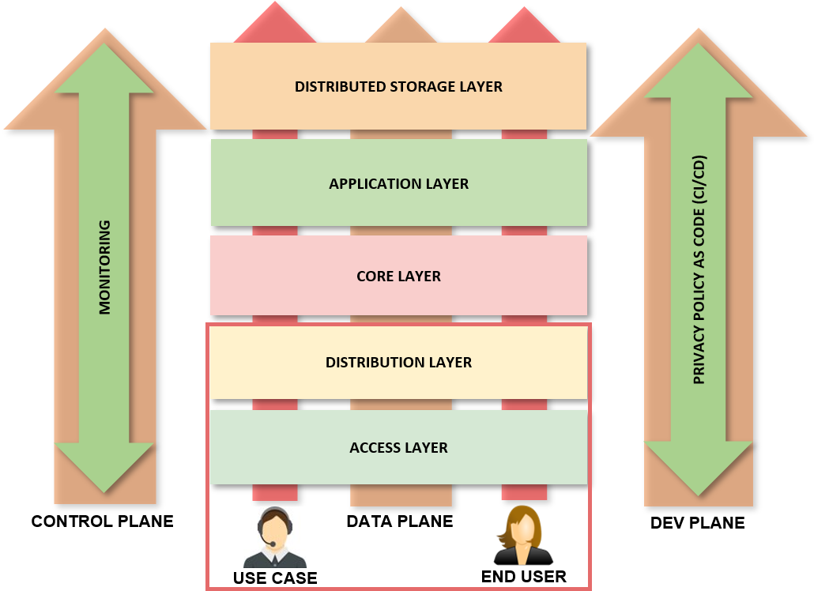
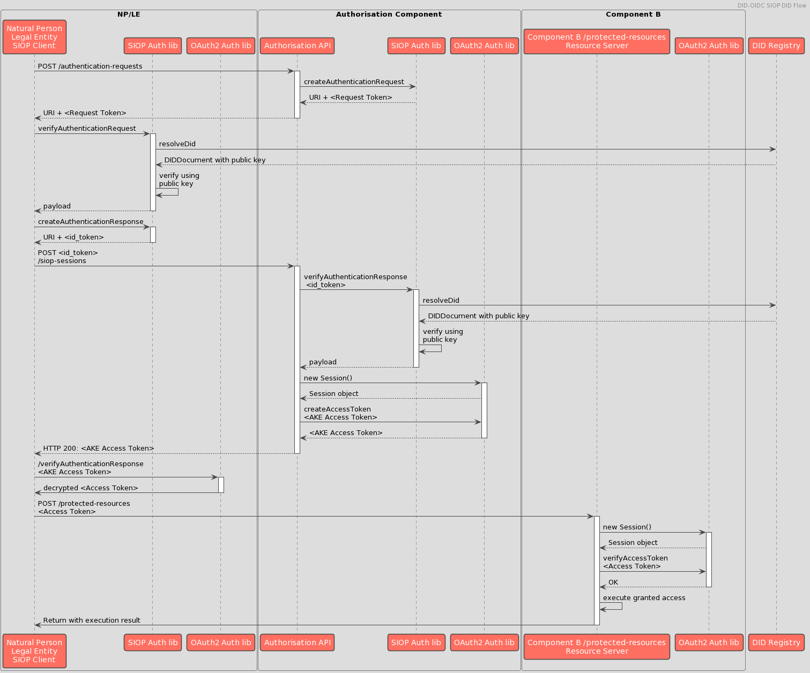

# Flujo de mensajes OAuth

## Foco de informe

La siguiente figura ilustra donde se pone el foco del estudio.

   

## Arquitectura

   

   [Código Fuente del diagrama](./img/DID-OIDC_SIOP_sequence_diagram.txt)
   [Herramienta de edición: PlantUML](https://plantuml.com/)

## Mensajes

## Software Bill of Material (SBOM)

|-----------------------|----------------------------------|-----------------------|
| Library Name          |        Issuer                    |   Status              |
|-----------------------|----------------------------------|-----------------------|
|[SIOP DID Profile](https://github.com/decentralized-identity/did-siop) | Decentralized Identity Foundation | Deprecated            |
|[Self Issued OpenID Provider v2 (SIOP)](https://github.com/Sphereon-Opensource/did-auth-siop)| Sphereon-Opensource| Last Update: 05/07/22 |
|[EBSI SIOP Auth Library](https://www.npmjs.com/package/@cef-ebsi/siop-auth)| EBSI                              | Last Update: 01/08/22 |
|[Verifiable Credential](https://www.npmjs.com/package/@cef-ebsi/verifiable-credential)| EBSI                              | Last Update: 02/08/22 |
|[Verifiable Presentation](https://www.npmjs.com/package/@cef-ebsi/verifiable-presentation)| EBSI                              | Last Update: 02/08/22 |
|[DID Resolver](https://www.npmjs.com/package/@cef-ebsi/ebsi-did-resolver)           | EBSI                              | Last Update: 01/08/22 |
|-----------------------|----------------------------------|-----------------------|

## Referencias

1. [Where to begin with OIDC and SIOP](https://medium.com/decentralized-identity/where-to-begin-with-oidc-and-siop-7dd186c89796), Medium Article.
2. [Self-Issued OpenID Provider v2](https://openid.net/specs/openid-connect-self-issued-v2-1_0.html), OpenID Standard.
3. [OpenID for Verifiable Presentations](https://openid.net/specs/openid-4-verifiable-presentations-1_0.html), OpenID Standard.