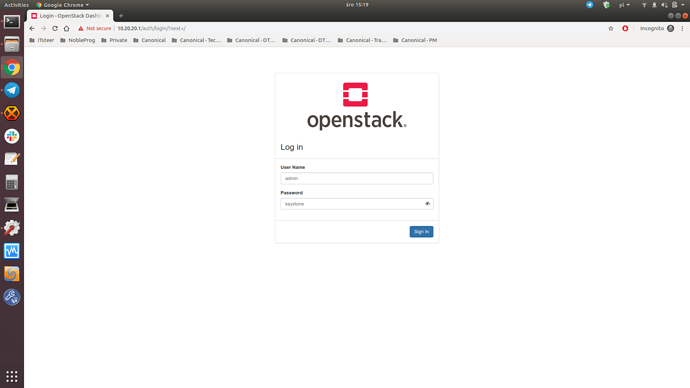
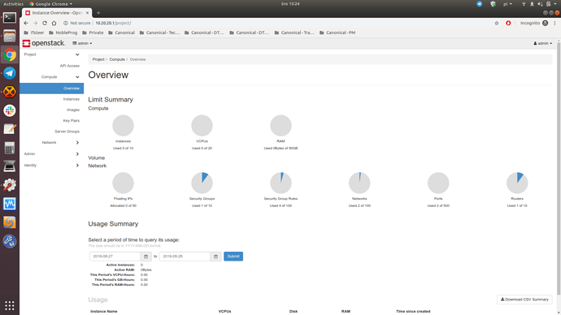
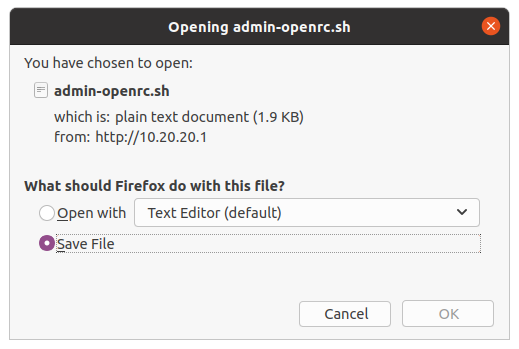

# How to deploy OpenStack
- [How to deploy OpenStack](#how-to-deploy-openstack)
  - [Overview](#overview)
    - [What is OpenStack?](#what-is-openstack)
    - [What is MicroStack](#what-is-microstack)
    - [What is Charmed OpenStack?](#what-is-charmed-openstack)
    - [Installation Requirements](#installation-requirements)
  - [Install OpenStack](#install-openstack)
  - [Launch an instance](#launch-an-instance)
  - [Learn about OpenStack components](#learn-about-openstack-components)
  - [Use MicroStack snap CLI](#use-microstack-snap-cli)
  - [Interact with the SQL database service](#interact-with-the-sql-database-service)
  - [Interact with the Message Queue service](#interact-with-the-message-queue-service)
  - [Log in to the OpenStack dashboard](#log-in-to-the-openstack-dashboard)
  - [Set up the OpenStack client](#set-up-the-openstack-client)

## Overview

OpenStack is a collection of open source projects designed to work together to form the basis of a cloud. OpenStack can be used for both private and public clouds.

### What is OpenStack?

OpenStack is the most popular open source cloud platform that aggregates distributed compute, network and storage resources in the data centre and enables on-demand provisioning of virtual machines through a self-service portal. OpenStack powers thousands of public and private clouds all over the world, providing rapid access for greater innovation and better economics.

### What is MicroStack

MicroStack is a micro cloud platform based on OpenStack, designed for the edge and small-scale data centre deployments, that can be installed and maintained with minimal effort. MicroStack eliminates the complexity behind OpenStack, providing an opinionated approach to OpenStack architecture design and a straightforward installation method.

### What is Charmed OpenStack?

Charmed OpenStack is an enterprise cloud platform based on OpenStack, designed for large-scale data centre deployments, that provides full automation around the initial installation and day-2 operations. Charmed OpenStack abstracts the complexity behind OpenStack, using a composable approach to OpenStack architecture design with model-driven operators (charms).

### Installation Requirements

One physical machine with:

- The latest Ubuntu LTS installed
- Multi-core CPU
- 8 GB of RAM
- 100 GB of storage

## Install OpenStack

We’re going to use MicroStack, since it provides the most straightforward installation experience. First, execute the following command to install the microstack snap:

```console
sudo snap install microstack --beta
```

If you are using an older Ubuntu version or some other Linux distribution, you may have to install snapd first. Refer to snapd documentation for more information on installing snapd on your computer.

When the installation process has finished you should see the following message on the terminal:

```console
microstack (beta) ussuri from Canonical✓ installed
```

Note that at the time of writing this tutorial, the installed version of OpenStack was Ussuri.

MicroStack can be initialised in either single or multi-node mode. Execute the following command to initialise it in the single-node mode:

```console
$ sudo microstack init --auto --control
```

The command takes ~20 minutes to complete. Once it finishes, OpenStack is up and running.

## Launch an instance

In order to launch your first instance on OpenStack, execute the following command:

```console
$ microstack launch cirros --name test
```

The resulting output provides the information you need to SSH to the instance:

```console
Access it with `ssh -i /home/guardian/snap/microstack/common/.ssh/id_microstack cirros@10.20.20.137`
```

Note that the IP address of the instance (here 10.20.20.137) may be different in your environment. In order to connect to the instance, run the following command from the terminal output:

```console
$ ssh -i /home/guardian/snap/microstack/common/.ssh/id_microstack cirros@10.20.20.137
```

That’s it. You’re connected to the instance. You can use regular shell commands to execute various tasks.

Note that the CirrOS image we used in this example provides a minimalistic operating system only, so the list of commands might be limited. For example, we can check the uptime of the instance:

```console
$ uptime
 11:08:36 up 2 min,  1 users,  load average: 0.05, 0.05, 0.01
```

To disconnect from the instance, type exit (or press CTRL+D).

## Learn about OpenStack components

While OpenStack is a large ecosystem, it can be broken down into smaller pieces.

In principle, OpenStack consists of the following basic components:

- OpenStack services expose API endpoints and handle basic cloud functions, such as image catalogue maintenance, instance provisioning, etc.

- OpenStack dashboard provides a web-based user interface for OpenStack services.

- OpenStack client provides a command-line user interface for OpenStack services.

- SQL databases store various records created by OpenStack services.

- Message queues facilitate inter-process communication between various components of OpenStack services.

Additional components, such as NoSQL database or memcached, might be required in more advanced scenarios.

## Use MicroStack snap CLI

MicroStack snap comes with an integrated OpenStack client. This means you can simply use the MicroStack snap CLI without installing the OpenStack client. In order to run a desired command, type microstack. and append the OpenStack client command. For example, to list all launched instances, run:

```console
$ microstack.openstack server list --all-projects
```

This will return the instance previously launched:

```console
+--------------------------------------+------+--------+-----------------------------------+--------+---------+

| ID | Name | Status | Networks | Image | Flavor |

+--------------------------------------+------+--------+-----------------------------------+--------+---------+

| b1cd9b64-ebc0-43ba-811b-3f14a65b32bf | test | ACTIVE | test=192.168.222.14, 10.20.20.137 | cirros | m1.tiny |

+--------------------------------------+------+--------+-----------------------------------+--------+---------+
```

Note that the ID of the instance and its IP addresses may be different in your environment.

You can also create an alias for the microstack.openstack command to remove the need to type the microstack. prefix when using the OpenStack client:

```console
$ sudo snap alias microstack.openstack openstack

Added:

- microstack.openstack as openstack

$ openstack server list --all-projects

+--------------------------------------+------+--------+-----------------------------------+--------+---------+

| ID | Name | Status | Networks | Image | Flavor |

+--------------------------------------+------+--------+-----------------------------------+--------+---------+

| b1cd9b64-ebc0-43ba-811b-3f14a65b32bf | test | ACTIVE | test=192.168.222.14, 10.20.20.137 | cirros | m1.tiny |

+--------------------------------------+------+--------+-----------------------------------+--------+---------+
```

## Interact with the SQL database service

The MicroStack snap integrates the MySQL client, which is the SQL database implementation used in MicroStack.

In order to interact with the MySQL database, first, obtain the root user password:

```console
$ sudo snap get microstack config.credentials.mysql-root-password
```

Sample output:

```console
MM7zSAkgrIr81wku7W1KJ0R9yP4ksphu
```

Then, connect to the MySQL interface using the obtained credentials:

```console
$ sudo microstack.mysql -u root -p
```

Once it opens, you can use regular MySQL commands to manage database records. For example, to list all created databases, run:

```console
mysql> show databases;
```

To disconnect from the MySQL interface, type exit (or Ctrl-d).

## Interact with the Message Queue service

The MicroStack snap integrates the RabbitMQ client, which is the Message queue implementation used in MicroStack.

In order to interact with RabbitMQ, you can use regular rabbitmqctl commands with the microstack. prefix added. For example, to list all queues, run:


```console
$ sudo microstack.rabbitmqctl list_queues
```

The MicroStack snap also provides other useful commands. Type microstack. and press TAB to display the full list.

## Log in to the OpenStack dashboard

In order to log in to the OpenStack dashboard, first, obtain the admin user password:

```console
$ sudo snap get microstack config.credentials.keystone-password
```

Sample output:

```console
lBF9sc7Tc28Bx6Sy1UznnyQg6PK2IfxK
```

Then, visit `https://10.20.20.1`, type the obtained credentials, and click the Sign in button:



From the OpenStack dashboard landing page, navigate to the admin drop-down menu in the top right, click it, and select OpenStack RC File to download the RC file that we’ll use in the “Set up the OpenStack client” section:



Depending on your browser, you may also need to accept the file:



## Set up the OpenStack client

Although MicroStack comes with an integrated OpenStack client, this is only useful if you installed MicroStack for yourself. In a multi-tenant environment, the OpenStack client needs to be set up by each tenant to enable remote connections to the OpenStack cloud.

First, remove the *openstack* alias we created in the “Use MicroStack snap CLI” section:

```console
$ sudo snap unalias openstack
```

Then, install the OpenStack client:

```console
$ sudo snap install openstackclients
```

When the installation process has finished, you should see the following message in the terminal:

```console
openstackclients (wallaby/stable) wallaby from Canonical✓ installed
```

Note that, at the time of writing this tutorial, the installed version of the client was Wallaby.

In order to communicate with the OpenStack cloud, the OpenStack client must have several environmental variables set. Those are defined in the RC file we downloaded in the “Login to the OpenStack dashboard” section. To set those variables, execute the following command, and type the admin user password we obtained in the “Log in to the OpenStack dashboard” section:

```console
$ source ~/Downloads/admin-openrc.sh
```

You can now use the OpenStack client to interact with your OpenStack cloud. For example, to list all launched instances, run:

```console
$ openstack --insecure server list
```